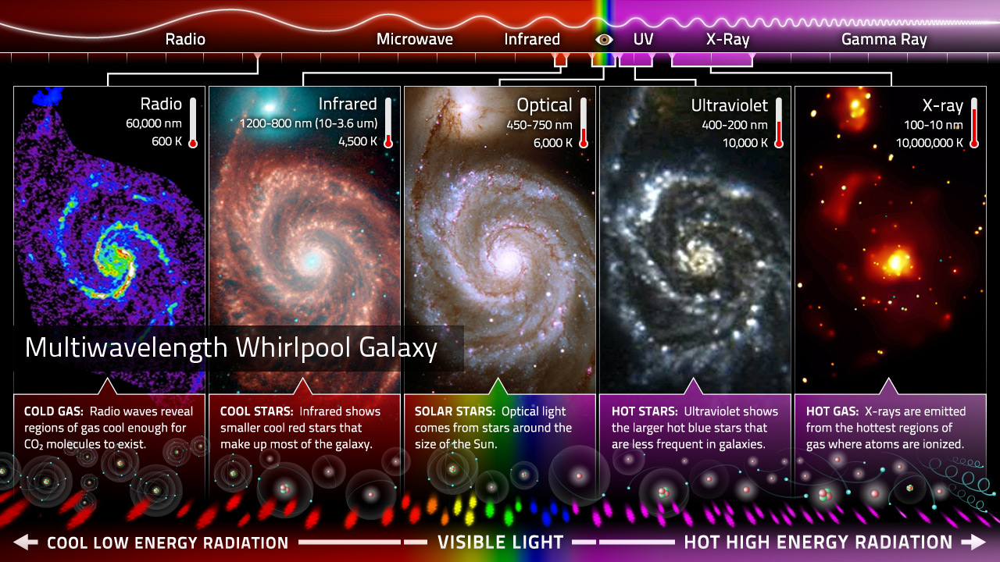

# AstroSpec

Spectroscopic models for astronomy under one registry and a common PyTorch
interface. The models cover spectral classification, redshift estimation,
stellar property estimation, and self-supervised representation learning on
native instrument grids. Each is a self-contained implementation, with
pretrained weights where available.

<!--  -->


*The spiral galaxy M51 in Canes Venatici as imaged in several regions of the
electromagnetic spectrum. The processes that produce the various forms of EM
radiation are described under each image. Courtesy: NASA/University of
Chicago.*

If you use this work, please cite:

```biblatex
@software{islam2026astrospec,
  title     = {AstroSpec: A unified library of spectral models for astronomy},
  author    = {Islam, Md. Khairul},
  year      = {2026},
  publisher = {Zenodo},
  doi       = {10.5281/zenodo.22119178},
  url       = {https://doi.org/10.5281/zenodo.22119178}
}
```

## Table of contents

- [Usage](#usage)
- [Models](#models)
- [Pretrained weights](#pretrained-weights)
- [Examples](#examples)
- [Resources](#resources)
- [Citations](#citations)

## Usage

```bash
pip install -e .
```

```python
import astrospec

astrospec.list_models()
model = astrospec.create_model("galspecnet", input_length=3522, num_classes=3)
```

Spectra carry more than flux. Models declare which of `flux`, `wavelength`,
`ivar`, `mask`, and `lsf_sigma` they consume. AstroSpec standardizes those
names, not the preprocessing. Surveys differ in grid, calibration, masking,
and resolution, and the library does not hide that.

Transformer models here consume patches rather than pixels, so the library
ships `astrospec.data.Patchify`. Those models will not run without it. The
caller handles everything else about loading and preprocessing. Apply
`Patchify` with the same settings to every per-pixel quantity and they stay
aligned; it also reports which patches are padding, so a model can mask
them.

```python
from astrospec.data import Patchify

patches, valid = Patchify(patch_size=20)(flux)
```

## Models

Each model is a plain `nn.Module` in `astrospec/models/`, one paper per module.
Architecture, shapes, and consumed inputs are documented in each module's
docstring.

| Model | Paper | Consumes | Task | Dataset |
|---|---|---|---|---|
| GalSpecNet | [Wu et al. 2023, MNRAS 527:1163](https://doi.org/10.1093/mnras/stad2913) | `flux` | GALAXY / QSO / STAR classification | SDSS |
| SpectrumEncoder (spender) | [Melchior et al. 2023, AJ 166:74](https://doi.org/10.3847/1538-3881/ace0ff) | `flux` | Autoencoding (reconstruction) | SDSS |
| SpecFormer | [Parker et al. 2024, MNRAS 531:4990](https://doi.org/10.1093/mnras/stae1450) | `flux`, patched | Masked patch reconstruction; cross-modal (image-spectrum) contrastive pretraining | DESI + DESI Legacy Imaging |
| AstroPT | [Smith et al. 2024, arXiv:2405.14930](https://arxiv.org/abs/2405.14930) | `flux`, `wavelength`, patched | Next-patch prediction (autoregressive pretraining) | DESI Legacy Imaging (spectra: Euclid Q1 follow-up) |
| GaSNet-III | [Zhong et al. 2025, MNRAS 543:691](https://doi.org/10.1093/mnras/staf1482) | `flux` | Spectrum reconstruction; downstream redshift estimation and anomaly detection | SDSS + DESI |
| SpecPT | [Pattnaik et al. 2025, ApJ 988:139](https://doi.org/10.3847/1538-4357/ade053) | `flux` | Autoencoding (reconstruction); downstream redshift estimation via `SpecPTRedshift` | DESI + SDSS |
| Universal Spectral Tokenizer | [Shen et al. 2025, arXiv:2510.17959](https://arxiv.org/abs/2510.17959) | `flux`, `wavelength`, `ivar`, patched | Autoencoding (reconstruction) on native, per-survey pixel grids | DESI + SDSS + GALAH + APOGEE |

### Downstream heads

A sequence encoder's tokens (`(B, T, embed_dim)`, from `forward_features` or
equivalent) need a fixed-size vector before a classification or regression
loss can apply to them. `astrospec.heads.CrossAttentionHead` does that
pooling: a learned query token cross-attends over the sequence, followed by
an MLP to the target width. This is the same head OmniSpectrum uses for
frozen-embedding evaluation and end-to-end fine-tuning alike, across
SpecFormer, AstroPT, SpecPT, and the Universal Spectral Tokenizer.

```python
from astrospec.heads import CrossAttentionHead

head = CrossAttentionHead(embed_dim=768, num_outputs=3)
logits = head(tokens)  # (B, num_outputs)
```

## Pretrained weights

`astrospec.pretrained` loads released checkpoints into the matching model,
with the optional `huggingface_hub` dependency (`pip install astrospec[pretrained]`).

| Model | Source | Params | Modality |
|---|---|---|---|
| SpecFormer | [`polymathic-ai/astroclip`](https://huggingface.co/polymathic-ai/astroclip) (AstroCLIP spectrum tower) | 43M | `flux`, patched |
| AstroCLIP (full, via the `astroclip` package) | [`polymathic-ai/astroclip`](https://huggingface.co/polymathic-ai/astroclip) | 370M | `flux` (spectrum branch) + image |
| AION-1 (via the `aion` package) | [`polymathic-ai/aion-base`](https://huggingface.co/polymathic-ai/aion-base) | 314M | `flux`, `wavelength`, `ivar`, `mask` (native grid) + 38 other modalities |

## Examples

Plain PyTorch notebooks in [`examples/`](examples/), added alongside the models
they use. Each reads its survey's spectra from a local MultimodalUniverse HDF5
tree or, failing that, streams them from the Hub.

| Notebook | What it does |
|---|---|
| [`galspecnet_source_classification_on_sdss.ipynb`](examples/galspecnet_source_classification_on_sdss.ipynb) | Trains GalSpecNet to separate GALAXY / QSO / STAR |
| [`spender_redshift_regression_on_sdss.ipynb`](examples/spender_redshift_regression_on_sdss.ipynb) | Trains spender's SpectrumEncoder to regress SDSS or DESI pipeline redshift |
| [`galspecnet_classification_on_astrom3.ipynb`](examples/galspecnet_classification_on_astrom3.ipynb) | Trains GalSpecNet to classify LAMOST variable-star spectra |
| [`specformer_pretraining.ipynb`](examples/specformer_pretraining.ipynb) | Pretrains SpecFormer on masked patches, then retrieves nearest neighbours in its embedding space |
| [`specformer_pretrained_similarity_search.ipynb`](examples/specformer_pretrained_similarity_search.ipynb) | Loads SpecFormer's released weights (from AstroCLIP's checkpoint) and retrieves nearest neighbours, no training |
| [`astroclip_similarity_search.ipynb`](examples/astroclip_similarity_search.ipynb) | Loads the full released AstroCLIP model and retrieves nearest neighbours by its aligned spectrum embedding |
| [`aion_spectrum_embeddings.ipynb`](examples/aion_spectrum_embeddings.ipynb) | Loads the released AION-1 model and retrieves nearest neighbours by its omnimodal spectrum embedding |
| [`astropt_pretraining.ipynb`](examples/astropt_pretraining.ipynb) | Pretrains AstroPT on DESI with its own causal next-patch objective, then retrieves nearest neighbours in its embedding space |
| [`astropt_classification_on_sdss.ipynb`](examples/astropt_classification_on_sdss.ipynb) | Trains AstroPT and a `CrossAttentionHead` fully supervised to separate GALAXY / QSO / STAR, with no pretrained checkpoint to start from |

## Resources

* [MultimodalUniverse](https://github.com/MultimodalUniverse/MultimodalUniverse): 100 TB of astronomical data in a single ML-ready format, including the spectroscopic surveys used here.

## Citations

Please cite this library (see `CITATION.cff`) along with the original works
behind the models you use.

```bibtex
@article{wu2024galaxy,
  title     = {Galaxy spectral classification and feature analysis based on convolutional neural network},
  volume    = {527},
  number    = {1},
  pages     = {1163--1176},
  journal   = {Monthly Notices of the Royal Astronomical Society},
  author    = {Wu, Ying and Tao, Yihan and Fan, Dongwei and Cui, Chenzhou and Zhang, Yanxia},
  year      = {2023},
  doi       = {10.1093/mnras/stad2913}
}

@article{melchior2023autoencoding,
  title     = {Autoencoding Galaxy Spectra. I. Architecture},
  volume    = {166},
  number    = {2},
  pages     = {74},
  journal   = {The Astronomical Journal},
  author    = {Melchior, Peter and Liang, Yan and Hahn, ChangHoon and Goulding, Andy},
  year      = {2023},
  doi       = {10.3847/1538-3881/ace0ff}
}

@article{parker2024astroclip,
  title     = {AstroCLIP: a cross-modal foundation model for galaxies},
  volume    = {531},
  number    = {4},
  pages     = {4990--5011},
  journal   = {Monthly Notices of the Royal Astronomical Society},
  author    = {Parker, Liam and Lanusse, Francois and Golkar, Siavash and Sarra, Leopoldo and Cranmer, Miles and Bietti, Alberto and Eickenberg, Michael and Krawezik, Geraud and McCabe, Michael and Morel, Rudy and others},
  year      = {2024},
  doi       = {10.1093/mnras/stae1450}
}

@article{smith2024astropt,
  title         = {AstroPT: Scaling Large Observation Models for Astronomy},
  author        = {Smith, Michael J. and Roberts, Ryan J. and Angeloudi, Eirini and Huertas-Company, Marc},
  year          = {2024},
  eprint        = {2405.14930},
  archivePrefix = {arXiv},
  primaryClass  = {astro-ph.IM}
}

@article{zhong2025galaxy,
  title     = {Galaxy Spectra Networks (GaSNet) -- III. Reconstructive pre-trained network for spectrum reconstruction, redshift estimate, and anomaly detection},
  volume    = {543},
  number    = {1},
  pages     = {691--708},
  journal   = {Monthly Notices of the Royal Astronomical Society},
  author    = {Zhong, Fucheng and Napolitano, Nicola R and Heneka, Caroline and Krogager, Jens-Kristian and Demarco, Ricardo and Bouch{\'e}, Nicolas F and Loveday, Jonathan and Fritz, Alexander and Verdier, Aur{\'e}lien and Roukema, Boudewijn F and others},
  year      = {2025},
  doi       = {10.1093/mnras/staf1482}
}

@article{pattnaik2025specpt,
  title     = {SpecPT (Spectroscopy Pre-trained Transformer) Model for Extragalactic Spectroscopy. I. Architecture and Automated Redshift Measurement},
  volume    = {988},
  number    = {1},
  pages     = {139},
  journal   = {The Astrophysical Journal},
  author    = {Pattnaik, Rohan and Kartaltepe, Jeyhan S. and Binu, Clive},
  year      = {2025},
  doi       = {10.3847/1538-4357/ade053}
}

@article{shen2025universal,
  title         = {Universal Spectral Tokenization via Self-Supervised Panchromatic Representation Learning},
  author        = {Shen, Jeff and others},
  year          = {2025},
  eprint        = {2510.17959},
  archivePrefix = {arXiv},
  primaryClass  = {astro-ph.IM}
}
```
